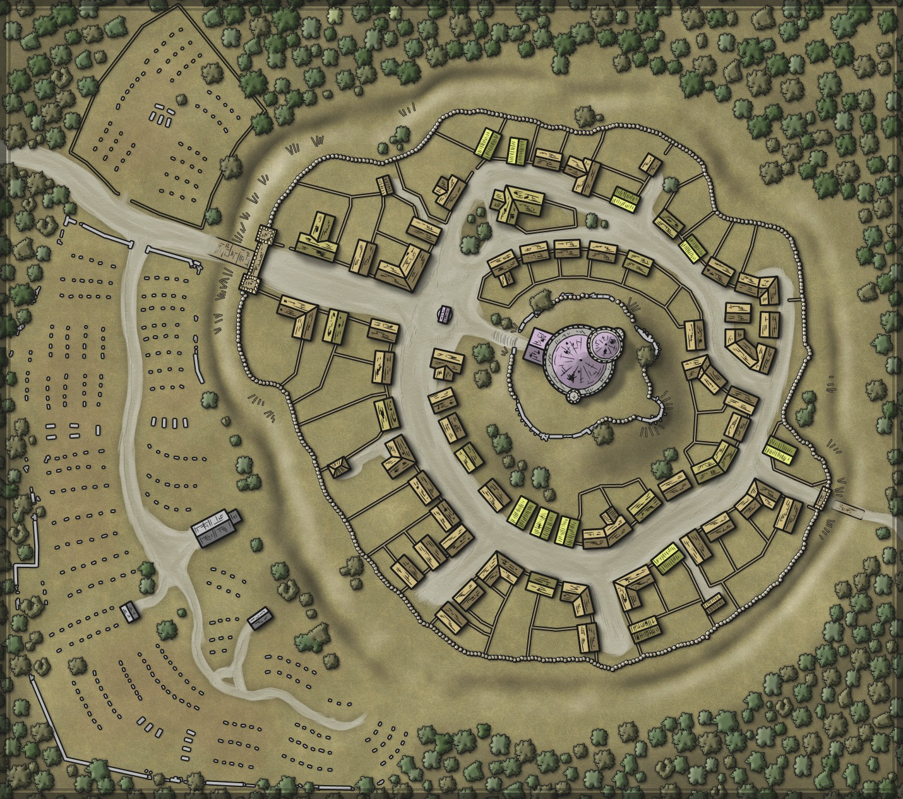
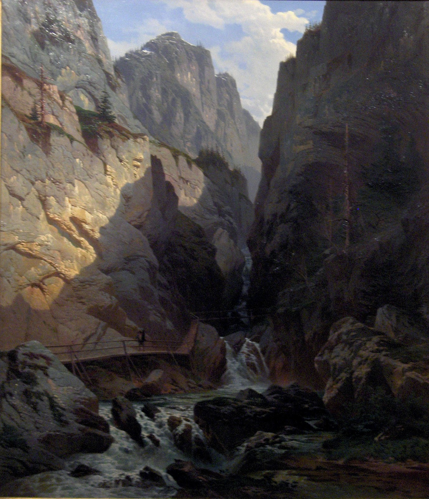
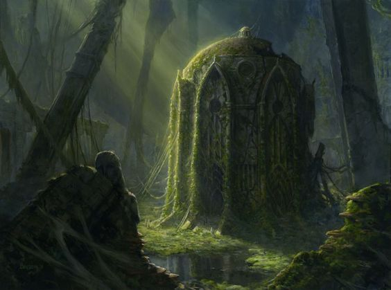
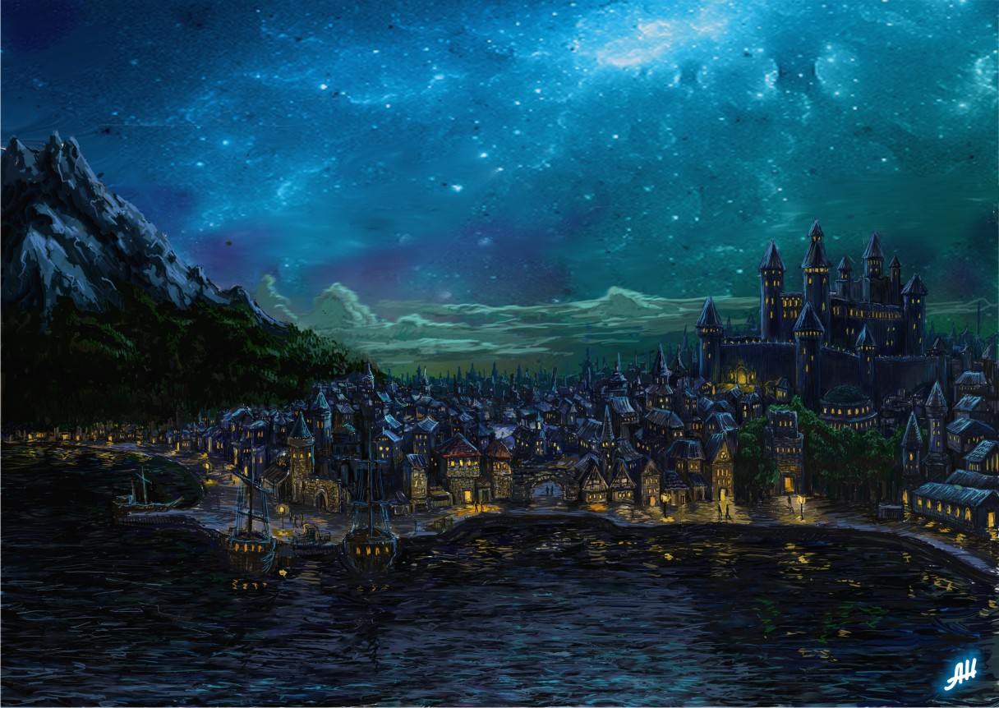

# The Glade
The 'Glade' is an outpost border-town of the city-state of Dranseri. The outpost lies near the northern border of Dranseri where it borders the elven kingdom of Deneria, to the west, and the lawlass lands of Esfenhir to the north, where Orcs are emerging once again as a cohesive threat after many years of simple raiding and roaming tribal clans.

## Basic Information
### Population
The population of the glade is largely comprised of farmers (who gather in the town to sell their crops during harvest season), fur traders and artisans from Khrif (mostly Sri'ssian merchants sourcing their goods), and the Queen's Wardens (the peace-keeping force of Dranseri responsible for protecting the lands from external threats).

The outpost generally maintains a stable population of around 750 people, with about another 500 in the surrounding farming areas.

Most residents of the glade are either human, elven, or half-elven. There are a handful of dwarves and other races as well.

### Geography
The town is picturesque. The spires of the Amorkh mountains are visible to the north above the dense forests of the Eredisian. Snow-capped for all but the doldrums of summer, they serve as navigational beacons for the area. The tallest, named after the goddes Selune, is about 20 degrees north and east of town and is amazing to behold - particularly at sunset when the oranges and purples of dusk cascade on its snow-covered surface. Small streams ring around the town to the north, before broadening to the south and leading into the tributaries of the Denarian river.

#### The Town
The town itself wraps around a small central stone fortress. While the fortress itself is small, it's tower is tall - rising a good 200 ft above the forest canopy surround the town. It provides amazing views of the surrounding area. The town's architecture suits the setting. Twelve foot tall stone walls ring the town and prevent animals, forest creatures, and (in days of old) other worse creatures like orcs, from casually strolling into town. The forest is cleared away from the walls and bits of stone and other aggregate has been placed around the walls to prevent the forest from creeping back up. It requires yearly maintanence to keep the clearing clear. Inside of town, there is not much to see. There are a few inns, a number of single family homes and the central fortress.

##### Stores
- The forest remembers, a Blacksmith owned by Selwyn Úrinwë (Everyone calls him Yore)
- A slice of Elysium, a Scroll and Potion Shop owned by Alysan Fainola
- The Squire's Shovel, a General Store owned by Arundel Walacia

##### Inns / Taverns
- Yeoman's Apple, a Tavern owned by Darian Ionadi
- Lavish Comestibles, a Tavern owned by Ardel Hlady

##### Places of Worship
- Sun Tree, a massive tree in the center of town. Sun Trees are said to be grown from seeds originating in the Dawnfather's own orchard on the plains of Elysium. This one is a brilliant specimen, whether or not it has such mystical origins. It radiates and refracts the light from the sun.
- Shrine of Melora, another large tree just outside of town. The tree (a weeping willow) is about 5x bigger than all other trees around it. Its branches hang low and seem to come alive with the least bit of wind. One can find bits of bone and sometimes flesh that marks the remains of offerings that have been left to the goddess of nature.
- Shrine of Selune, a small circular area in the forest outside of town. A ring of stone circles mark a definite break in the trees. Usually worshipers visit the shrine at night - where moonlight beams into the glade. Many say this is where the city gets its name.

#### Significant Areas Nearby
##### The Queen's Pass
North of town in the mountains is the Queen's pass that is guarded all year by Wardens. Orcs usually stay away, but there have been several incursions and small scale conflicts over the years.

##### Ancient Elven Ruins
Deep in the Eredisian forest to the west is an extremely ancient temple. The residents of The Glade are aware of it, but regard it with fear and consternation. The Elven residents seem to revere it and many make once a year pilgrimages to the location to leave a portion of their harvest in honor of Corellon and Melora.

##### The Princess's road
A small road, which eventually merges with the Queen's road, passes through the Glade from the Queen's pass to Dranseri.

##### Leshir
Far north of the Glade is the former Orcish outpost of Leshir. In the last 100 years or so, Leshir has been nothing more than a ghost town. Noone from the Glade generally goes past the Queen's pass, but word from roaming rangers fuels rumor mills in town. The latest word is that Leshir is alive with activity and that the rangers last sent to patrol the area never came back.

## Party Background
Most of you are originally from the Glade, but some of you settled here after coming through town in your travels.

Your party `(insert name here)` was formed two years ago when the farming community outside of the Glade was threatened by a number of undead that began mysteriously arriving in the outskirts of town. Several farmers were killed and, not content to wait for the Queen's Wardens to send more men and women from Dranseri to handle it, you took it upon yourselves to protect your community and deal with the threat.

Since then, you have gone on a few adventures north into the Amorkh mountains and to the west in the Eredisian forest. You've also been to the capital once or twice.

As local heroes, the Wardens often work with you and use your services in various dealings for the queen.

### Current status
You've received word from the Wardens that their rangers have reported significant activity to the north. Orc's move in mass towards Sri'ss. The numbers they are reporting are staggering (tens of thousands). The wardens have already sent word to the Queen's hand (a general named Thoromir).

There is also a fervor in town, particularly among the Elven folk. Apparently, a few pilgrims recently returned and claim they saw large moving stone men roaming the ruins. One man claims there were pillars of light emanating from the a caved-in portion of what used to be the ancient temple.

# Background on the City-state of Dranseri (your characters would be aware of this)
The city-state of Dranseri is the dominant Queendom of Arklan. Historically, Dranseri has been the center of post-elven civilization in Arklan. The city, for which the city-state gets its named, was mostly destroyed in the Cataclysm, but was rebuilt subsequently and has stood for nearly a thousand year since. The city is divided into five quarters:

## 'The Square'
A large, square-shaped mercantile district - the largest of its kind in Arklan. There are vendors for nearly any good imaginable.
Shops includes:
* The Scribbled Troglodite Books
* The Oak Hydra Carpentry Shoppe
* Shimmering Reaper Jewelry Shoppe
* The Wild Mace Tanning Shoppe  
* New Nixie Bow Crafters
* The Choral Stone Giant Instrument Crafters    
* Wooly Fish Tailor Shoppe    
* The Cheap Pixie Anvil    
* The Concocted Ogre Potion Shoppe    
* Copper Gnome Library    
* The Quiet Triton Leather Market    
* The Traveling Snake Pawn    
* The Humming Minotaur Stringed Instruments   
* Toasty Adventurer Bakery     
* Common Boar Pets    
* Gleaming Frog Pearls
* The Wealthy Weasel Blacksmith
* The Stone Arrow Archery Shoppe
* The Royal Idol Book Shoppe
* The Hidden Golem Forge
* The Sparkly Titan Diamonds    
* The Lyrical Demon Instruments
* The Adventurous Gargoyle Goods
* among others...and many taverns and inns

### Tinkering Guilds
"The Clockwork Constructs" - a mostly gnomish guild focused primarily on the development of mechanisms and creations that automate worldly tasks or "Lofty Ambitions" - a multi-racial (with large contingent of gnomes and dwarves) guild focused on flight technology. Specifically, their grand ambition is to combine magic with engineering to make a flight machine (airship). While they have demonstrated small subcomponent research achievements, e.g. high tensile lightweight sails and advances in magical materials science needed to hold the devices aloft, they have yet to master the physics necessary to keep such creations for careening and crashing horribly out of control.

Both guilds rely on rare "Diathion Crystals" mined in remote places around Arklan to power their builds. These crystals are also the foundation of your Thunder Cannon technology.

## The Docks
The largest bay and shipping harbor in Arklan. Most trade goods come through Dranseri's docks or Driftai Bay

## The Temple District
While not the largest in Arklan, there are significant numbers of competing churches where the people of Dranseri are free to worship their favorite (good/neutral) deities.

## The Government District (AKA Sky district)
Where the largest empire in Arklan is run from. While Dranseri and the other city states exist in a state of peace, Dranseri is the dominant, more militaristic society on the continent and exerts a large degree of control over the other city-states.

Included in the sky district is the central
### Fortress of the ruling monarchs of Dranseri (Dransers)
The Dransers are the historic ruling family as far back as the Lhordic wars.
* Current ruler is Queen Rae Dranser
* She has two sons Daenor and Raelorn and two daughters Thae and Laeana

### Sky District
The high noble families also live here in the Sky District around Dranser Castle.

## The Slums
A large area near the docks where low-born peoples (under the mercantile class) live. Parts of the Dranseri Slums are fancier than the middle-class neighborhoods of other city-states in Arklan. That said, there is a large block of the slums that are considered unsafe and unsavory by the middle and highborn familes.
